## "Life is precious, don't waste it."

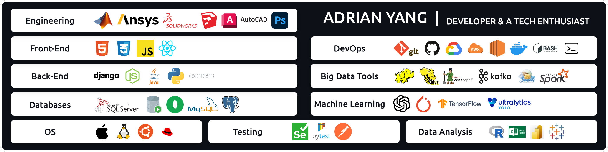

## Hi, this is Adrian Y. Welcome to my page. 

Here, you'll find a curated selection of my technical projects and extensions.

## Contact information 

Thank you for your support and usage! If you encounter any problems or have any suggestions during use, please feel free to contact me.  
Work Email: adrianyangbiz@gmail.com

---
 
 

# Released App(s):

<!-- Web Video Speed Controller Extension -->

---

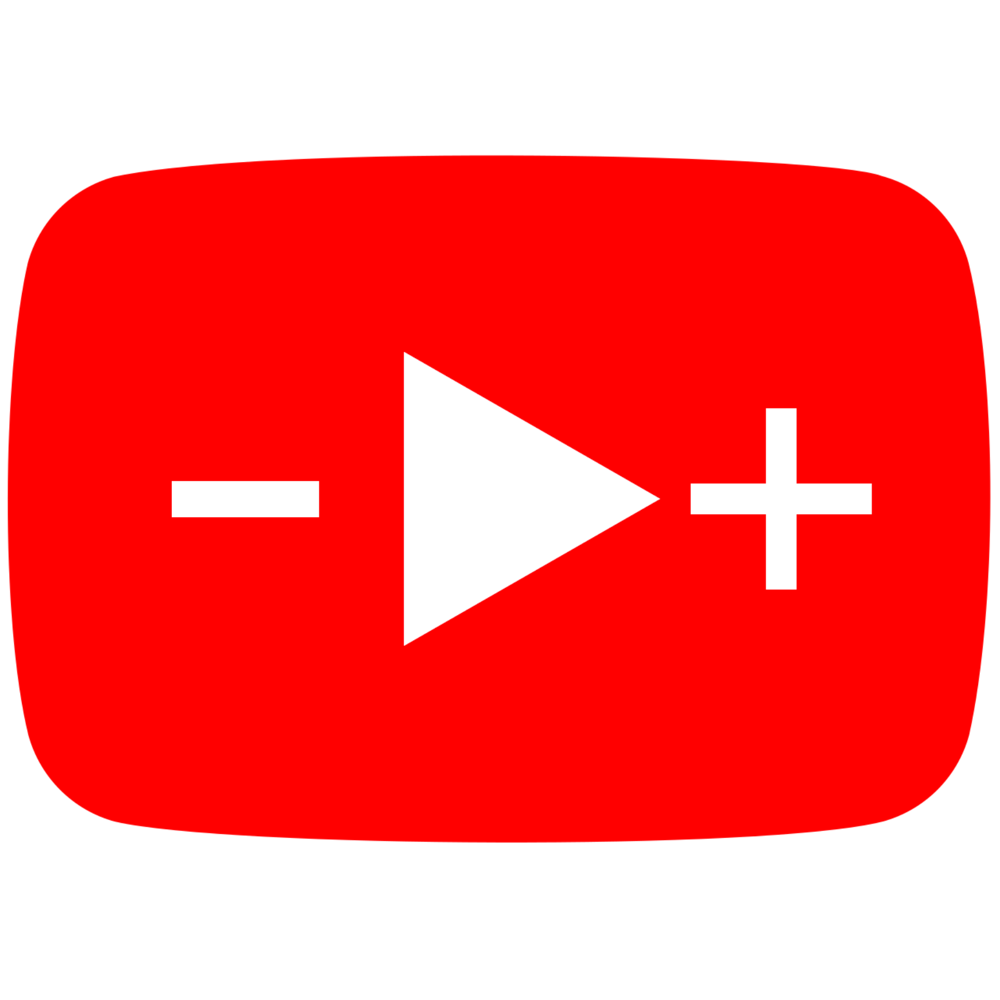

# [Web Video Speed Controller Extension (For Both Google Chrome & FireFox Browsers)](https://github.com/aynorway/web-video-speed-controller)

---

 This extension allows users to effortlessly control the playback speed of any online video. Easily operable via a floating interface, keyboard shortcuts, or simple mouse actions.

---

### For a comprehensive documentation, please refer to: &nbsp;&nbsp;&nbsp;&nbsp;[☞ English (英文)](https://github.com/aynorway/ay-youtube-speed-controller/blob/master/README.md)&nbsp;&nbsp;&nbsp;&nbsp;&nbsp;&nbsp;&nbsp;&nbsp;[☞ Chinese (中文)](https://github.com/aynorway/ay-youtube-speed-controller/blob/master/README_cn.md)

--- 

Hello everyone, I'm Adrian Y, "老6". This is a powerful browser extension I developed in my spare time. It allows users to freely control the playback speed of almost any online video, with perfect compatibility for YouTube. Not just specific to certain video services, it's suitable for nearly all websites using standard video players, such as Vimeo, Bilibili, Youku, etc. It caters to those who require precise speed adjustments, with an accuracy of 0.01x and up to 16x speed. The extension is compatible with both Chrome and Firefox browsers. It's currently available for free, and I hope it helps you all!

This software does not utilize an open source license; click [here](JS_File_Disclosure_Explanation.md) for the rationale.

## Visit Firefox Add-ons Store to Download 

**Extension Name**: Web Video Speed Controller  
**Compatible With**: Firefox Browser  
**Download Link**: [Visit Firefox Add-ons Store to download Web Video Speed Controller](https://addons.mozilla.org/en-CA/firefox/addon/web-video-speed-controller/)

## Visit Chrome Web Store to Download 

**Extension Name**: Web Video Speed Controller  
**Compatible With**: Chrome Browser  
**Download Link**: [Visit Chrome Web Store to download Web Video Speed Controller](https://chromewebstore.google.com/detail/web-video-speed-controlle/aehooioefgnglgpgneckhcbhefkmhlpn?utm_source=chrome-ntp-icon)

## User Guide

| 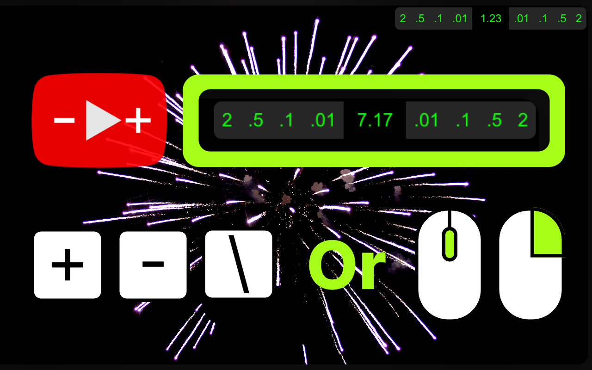 | 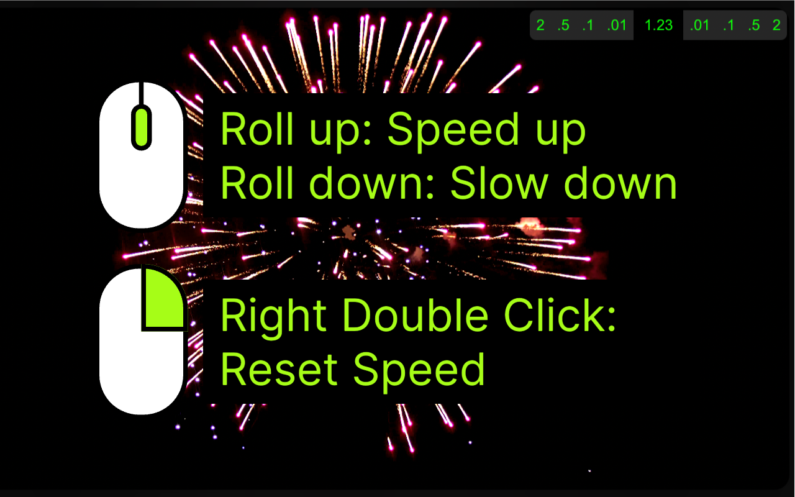 |
|:--:|:--:| 

| 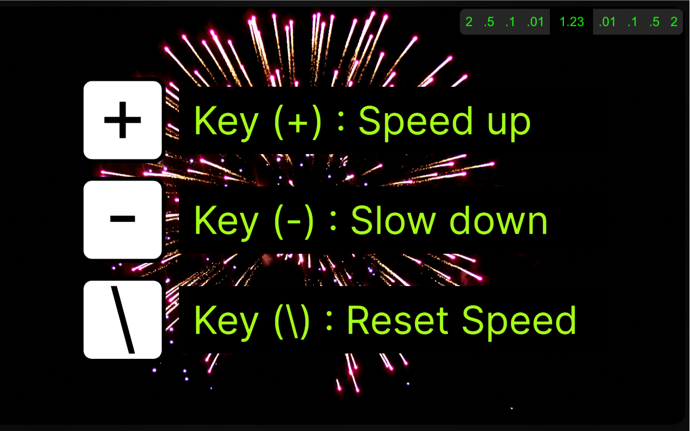 | 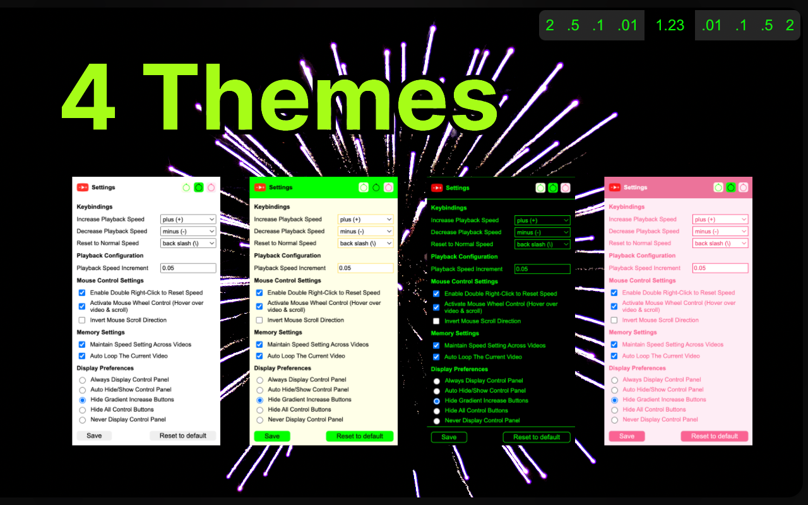 |
|:--:|:--:| 

## Features

1. Adjust video playback speed: increase, decrease, or reset to standard rate.
2. Customizable keyboard shortcuts supported.
3. Convenient mouse controls: hover over the video for fine-tuned speed adjustments.
4. Define your own speed increment preferences.
5. Quick revert to original speed with a double right-click.
6. Memory function: auto-replay videos upon completion.
7. Remember your chosen playback speed and apply it across all videos.
8. On-screen control panel shows real-time playback speed.
9. Five distinct display styles for the on-screen control panel, including the option to hide.
10. Four theme colors to choose from.
11. Fully compatible with both Chrome and Firefox browsers.

## Settings Interface 

| 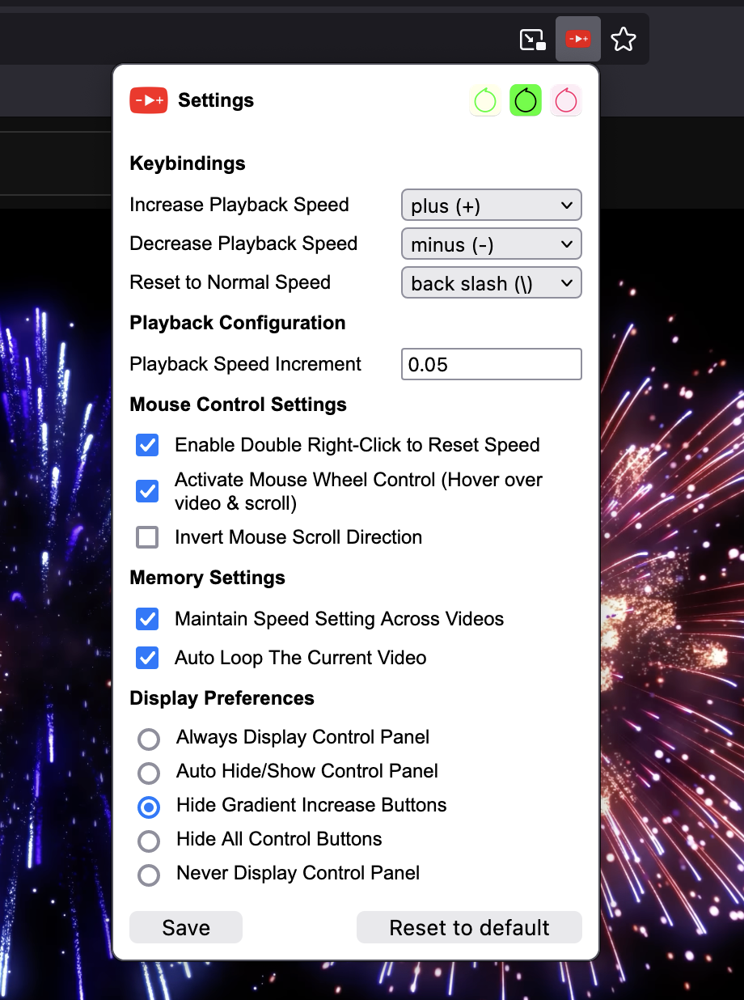 | 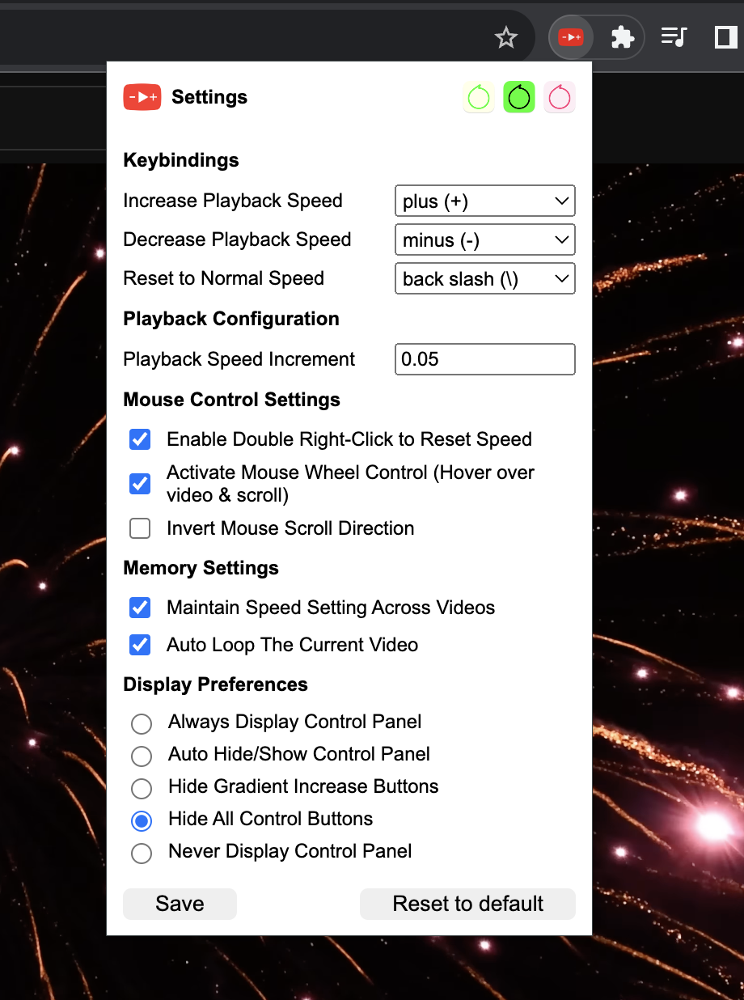 |
|:--:|:--:| 
| Firefox Browser Settings Interface | Chrome Browser Settings Interface |

## User Interface 

| 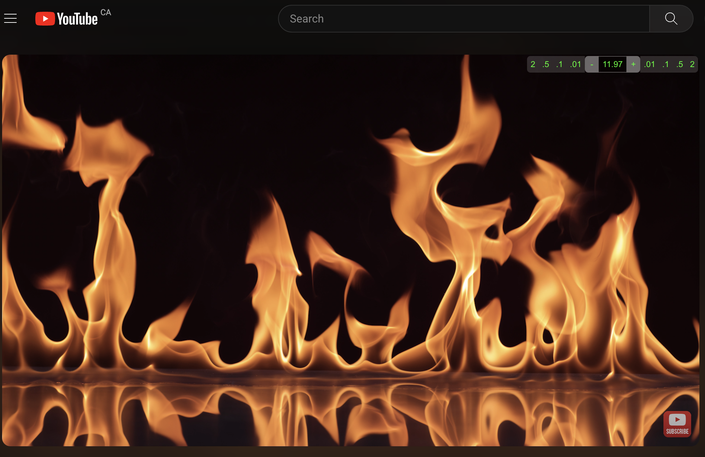 |
|:--:| 
| YouTube Interface |

| 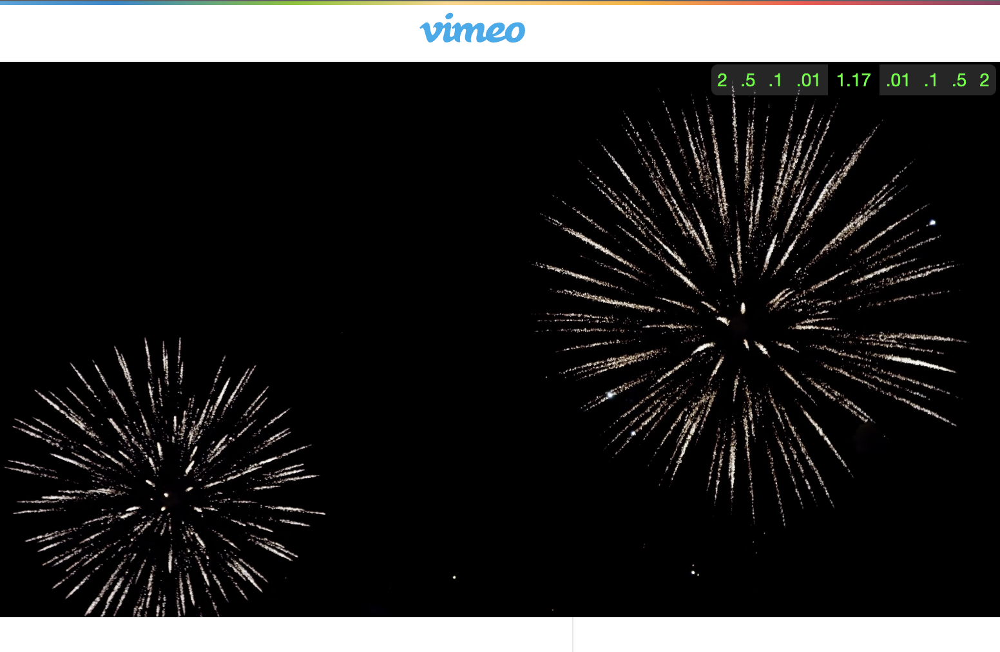 |  |
|:--:|:--:| 
| Firefox Browser Settings Interface | Chrome Browser Settings Interface |

---
 
 
 
 

<!-- Youtube Auto Loop -->

---

# [Youtube Auto Loop Extension (Applicable:  Chrome & Firefox Browsers)](https://chromewebstore.google.com/detail/youtube-auto-loop/alogflekkffcjmpbkiejclcooieofeee?hl=en)

---

 Automatically remember the settings to loop/unloop all YouTube videos, eliminating the need for manual intervention.

---

## Key Features

Auto-Loop Functionality.
Memory Feature - remembers settings for each video.

## User Guide

Setting Up Auto-Loop:
Once installed, navigate to any YouTube video.
Click on the extension icon in your browser toolbar.
Enable the 'Auto-Loop' toggle.

## Settings Interface 

| 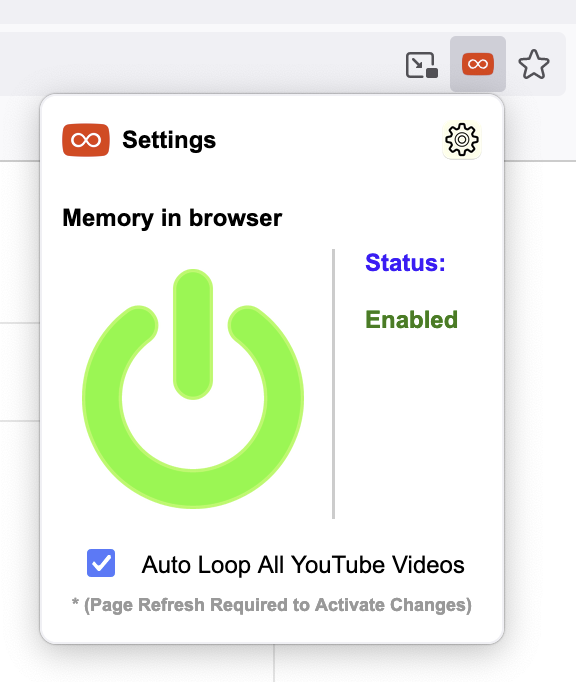 | 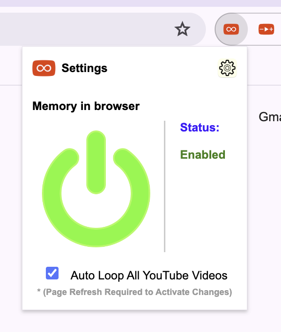 |
|:--:|:--:| 
| Firefox Browser Settings Interface | Chrome Browser Settings Interface |

## Visit Firefox Add-ons Store to Download 

**Extension Name**: Youtube Auto Loop  
**Compatible With**: Firefox Browser  
**Download Link**: [Visit Firefox Add-ons Store to download](https://addons.mozilla.org/en-CA/firefox/addon/youtube-auto-loop/)

## Visit Chrome Web Store to Download 

**Extension Name**: Youtube Auto Loop  
**Compatible With**: Chrome Browser  
**Download Link**: [Visit Chrome Web Store to download](https://chromewebstore.google.com/detail/youtube-auto-loop/alogflekkffcjmpbkiejclcooieofeee?hl=en)

---
 
 
 
 

<!-- timetrackbar -->

---

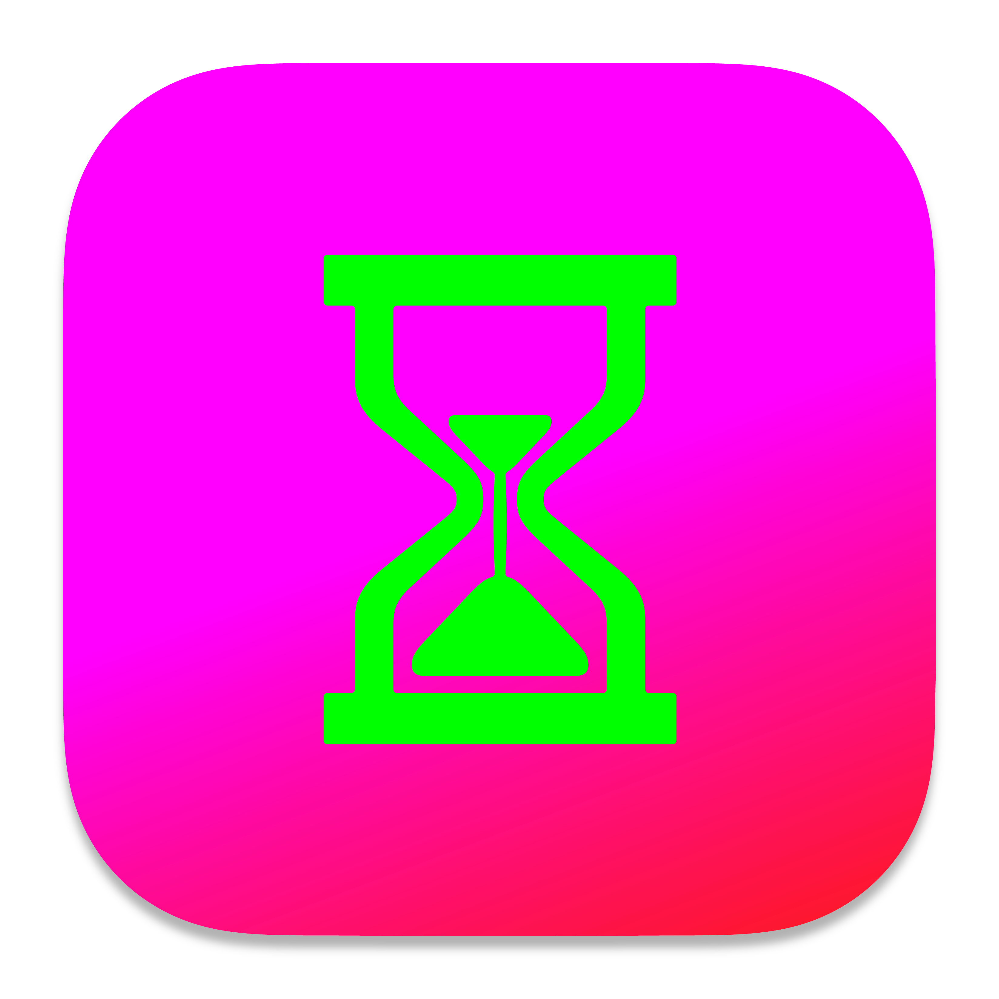 

# [TimeTrackBar Desktop Application (For Both Mac & Windows)](https://github.com/aynorway/ay-timetrackbar-java/tree/master)

---
 TimeTrackBar is a minimalist Java-based timer designed for intuitive time tracking, offering both visual progress and cross-platform support. Packed with features, it aids effective time management and remains open-source.

--- 

### For a comprehensive documentation, please refer to: &nbsp;&nbsp;&nbsp;&nbsp; [☞ English (英文)](https://github.com/aynorway/timetrackbar/blob/master/README.md)&nbsp;&nbsp;&nbsp;&nbsp;&nbsp;&nbsp;&nbsp;&nbsp;[☞ Chinese (中文)](https://github.com/aynorway/timetrackbar/blob/master/README_cn.md)

---

Hello everyone, I'm Adrain Y, also known as "老6". This time-tracking software is one of my personal favorite software projects. I've always been on the lookout for a tool that displays both the time and a progress bar, aiming for a more intuitive feel of the passing time. After not finding a minimalist timer that met my requirements for quite some time, I decided to create one myself. Currently, I use this software almost daily to track my work hours, which greatly assists me in understanding and allocating my time more effectively. This project is developed entirely in Java, ensuring easy cross-platform compilation. Versions for both MacBook and Windows have been released. To guarantee the software's compatibility, I've intentionally employed the foundational Unicode character set. In the upcoming versions, I plan to introduce several new features, including report generation, data analysis, and an always-on-top window feature. Moreover, the ability to continue monitoring time even when the computer is in sleep mode is under development. I invite everyone who values their time to give it a try. This software will remain open-source indefinitely, hoping to benefit many.

## Features

- Extremely user-friendly logic.
- Automatic time calculation with progress display.
- Clear progress bar interface.
- Ability to add/delete multiple timing tasks.
- Start/pause timer functionality.
- Sound alert/mute feature.
- Auto detection of stopwatch/countdown mode.
- "Always On Top" mode for keeping the application window in the foreground.

## User Interface Guide

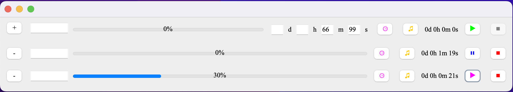
From left to right:

- **"+" Button**: Add a new timing task.
- **"-" Button**: Delete a specific timing task.
- **Text Input Box**: Supports up to 7 characters, suitable for brief notes or memos.
- **Progress Bar**: Displays the timing progress.
- **⏲ Icon Button**: Click to expand or hide the time setting panel.
- **Sound Toggle Button**: Default is a musical note (♫). Clicking it changes to a crescent moon (☽) indicating mute. Through this button, you can decide whether to sound an alert when the timer ends.
- **Remaining Time Display**: Shows the remaining time for the timer or countdown.
- **▶ Button**: Start or pause the timer. Blue in stopwatch mode and magenta in countdown mode.
- **⏹ Button**: Stop and reset the timer completely.

## Installation and Usage

**Windows users**: [☞ Download TimeTrackBarPackage v1.0 for Windows (.exe)](https://github.com/aynorway/timetrackbar/releases/download/v1.0/TimeTrackBarPackage.exe) 

**macOS ARM (M-series) users**: [☞ Download TimeTrackBar v1.2 for macOS (.dmg)](https://github.com/aynorway/ay-timetrackbar-java/releases/download/v1.2/TimeTrackBar-1.2.dmg)

 
 
 
 
 